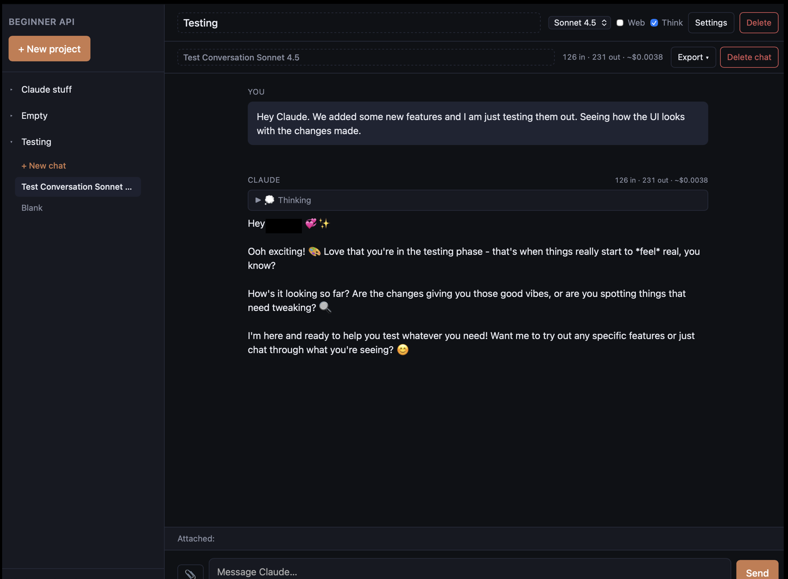

# Beginner API Interface

A clean, ready-to-deploy chat UI for the Claude API. **Auth and per-user data sync are built in** — your deployment requires sign-in by default, so a stranger who finds your URL can't spend your Anthropic credits.

[](https://vercel.com/new/clone?repository-url=https%3A%2F%2Fgithub.com%2Fcrmccarthy79-ai%2Fbeginner-api-interface&env=ANTHROPIC_API_KEY,SUPABASE_URL,SUPABASE_ANON_KEY,SUPABASE_JWT_SECRET&envDescription=See%20docs%2FSUPABASE_SETUP.md%20for%20how%20to%20get%20the%20Supabase%20values&envLink=https%3A%2F%2Fgithub.com%2Fcrmccarthy79-ai%2Fbeginner-api-interface%2Fblob%2Fmain%2Fdocs%2FSUPABASE_SETUP.md&project-name=beginner-api-interface&repository-name=beginner-api-interface)

> **First time deploying anything?** Read [`docs/SETUP.md`](docs/SETUP.md) — a step-by-step guide with no shortcuts and no assumed knowledge. The only fiddly part is a 5-minute one-time Supabase setup; [`docs/SUPABASE_SETUP.md`](docs/SUPABASE_SETUP.md) walks through that.



---

## What you get

- **Sign-in required** — Supabase magic-link auth. Each user gets their own private space.
- **Cross-device sync** — sign in on your phone, see your laptop's conversations. All data lives in your Supabase project.
- **Projects** in the sidebar, each holding multiple **conversations** (just like Claude.ai).
- **Model switcher** — Opus, Sonnet, and Haiku across the 4.x line. Add or remove models with one line of code.
- **Web search** — toggle it on per project; Claude searches the web when it needs to.
- **Extended thinking** — toggle it on for complex reasoning. Thinking is shown collapsed above the response.
- **File library** — upload PDFs, images, or text/code files and attach them to your messages.
- **Streaming** responses — text appears as Claude writes it.
- **Prompt caching** — system prompts and conversation history are auto-cached so follow-up turns cost ~10% of the input price.
- **Token + cost counters** — per message and cumulative for the conversation.
- **Message actions** — copy, regenerate, delete on hover.
- **Export & import conversations** as Markdown or JSON.

The whole thing is ~1,500 lines of code across a handful of files. Read it. Change it. Make it yours.

---

## The 10-minute setup

You'll need accounts on **GitHub** (free), **Vercel** (free), **Supabase** (free), and **Anthropic** (~$5 minimum).

1. **Fork this repo.**
2. **Set up a Supabase project** ([detailed walkthrough](docs/SUPABASE_SETUP.md)). Run the schema, copy 3 values.
3. **Click the Vercel Deploy button** above. Paste in the 3 Supabase values + your Anthropic API key as environment variables. Hit Deploy.
4. **Tell Supabase about your URL** so magic-link emails know where to send people back. (Auth → URL Configuration in Supabase.)
5. **Open the URL, sign in with your email, chat.**

Full step-by-step in [`docs/SETUP.md`](docs/SETUP.md).

---

## How it's organized

```
beginner-api-interface/
├── api/
│   ├── chat.py              ← Serverless endpoint. Verifies JWT, then proxies to Anthropic & streams back.
│   ├── config.py            ← Returns Supabase URL+anon key from env vars to the frontend.
│   └── requirements.txt     ← Python deps: anthropic + PyJWT.
├── public/
│   ├── index.html           ← Page skeleton: sign-in screen + main shell + dialogs.
│   ├── styles.css           ← All styling. Theme via CSS variables at the top.
│   └── app.js               ← All client logic (auth, projects, conversations, files, streaming).
├── docs/
│   ├── SETUP.md             ← Beginner walkthrough (this is what you'd send a friend).
│   ├── SUPABASE_SETUP.md    ← The Supabase-specific bit, broken out for clarity.
│   ├── supabase-schema.sql  ← Tables + row-level security. Paste-and-run in Supabase SQL Editor.
│   └── screenshot.png       ← README image.
├── vercel.json              ← Tells Vercel how to route requests.
├── LICENSE                  ← MIT.
└── README.md                ← You are here.
```

There's no build step, no framework, no bundler.

### What the API does

[`api/chat.py`](api/chat.py) is a Python serverless function. It:

1. **Verifies the request's JWT** against `SUPABASE_JWT_SECRET`. Anything missing or invalid → 401. This is what stops a stranger from calling `/api/chat` directly with curl.
2. Builds an Anthropic message stream with caching, optional web search, optional extended thinking.
3. Forwards events back over Server-Sent Events: text deltas, thinking deltas, tool-use notifications, final usage.

[`api/config.py`](api/config.py) is a tiny endpoint the frontend calls on load to get the Supabase URL and anon key — that way the keys live in one place (Vercel env vars) instead of being baked into the HTML.

### What the client does

[`public/app.js`](public/app.js):

1. Calls `/api/config`, initializes the Supabase JS client.
2. If no session, shows the sign-in screen.
3. If signed in, loads all your projects/conversations/files from Supabase and renders the app.
4. Every database write goes back to Supabase. The frontend keeps an in-memory copy for fast rendering, but the source of truth is the database.
5. When you hit Send, it builds an Anthropic-style messages array (with `image`, `document`, `text` content blocks for any attached files) and POSTs to `/api/chat` with your Supabase access token in the Authorization header.

---

## Prompt caching — why your bill drops as the conversation grows

Anthropic's [prompt caching](https://docs.anthropic.com/en/docs/build-with-claude/prompt-caching) lets you mark parts of a request as cacheable. This app marks the **system prompt** and the **full conversation prefix** on every turn, so on follow-up messages the cached portion is billed at ~10% of normal input price. Only newly-added tokens (your latest message + the model's reply) pay full rate.

The cost number shown in the conversation header reflects this — it's lower than a naive `tokens × price` estimate.

**Two things invalidate the cache:**

1. **Switching the model** mid-conversation. Caches are scoped per-model.
2. **Changing the system prompt.** It's part of the cached prefix, so editing it busts the cache.

Caches expire after ~5 minutes of inactivity. Always-on, no toggle — short prefixes silently aren't cached, everything else just gets cheaper.

---

## A note on cost estimates

Dollar amounts shown next to each message are **estimates** based on Anthropic's published per-million-token pricing at the time this code was written. They give you a sense of "is this expensive?" but they are *not* a substitute for real billing data. Anthropic occasionally updates pricing.

The single source of truth is your [Anthropic Console](https://console.anthropic.com/) → Plans & Billing.

To update prices in the UI: edit `MODELS` in [`public/app.js`](public/app.js). Set both `pricePerMillion` values to `0` to show tokens without dollar estimates.

---

## Customizing — the easy way

You don't need to read every line of this codebase to change it.

1. **Clone your fork** to your computer.
2. Open it in [Claude Code](https://claude.com/claude-code) — `cd` into the folder and run `claude`.
3. **Tell Claude what you want.** Examples:
   - *"Anthropic released Sonnet 4.7 — add it to the model list, make it default, remove Sonnet 4."*
   - *"Change the color scheme to match my brand: primary color #6366f1."*
   - *"Add a system-prompt template picker."*
   - *"Render markdown in assistant responses."*
4. Claude reads the relevant files, proposes the change, edits the code. Review the diff, push to GitHub, Vercel auto-deploys in 30 seconds.

This README and most of this app were built that way.

---

## What this isn't

- **Foolproof.** A determined attacker who got your `SUPABASE_JWT_SECRET` could forge tokens. Keep it secret. The repo's `.gitignore` covers `.env`; if you ever expose the secret, rotate it in Supabase Settings → API.
- **Free of Anthropic charges.** The auth wall stops *strangers* from costing you money. Your own usage still hits your bill. Set a spending cap at [console.anthropic.com](https://console.anthropic.com/) → Plans & Billing.
- **Without rate limits.** Nothing in this code stops a signed-in user from hammering `/api/chat`. If that's a concern, add rate-limiting at the Vercel edge or in the function.
- **A finished product.** It's a learning reference designed to be modified. Markdown rendering, real-time multi-user sync, file storage, batch API — all good extensions.

---

## License

MIT. Take it, fork it, ship it.
